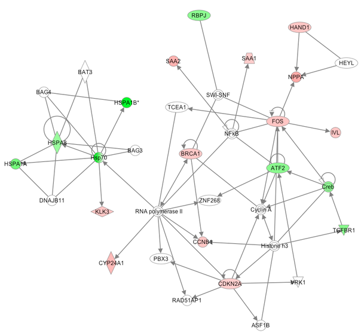

## Course Description

Quantitative proteomics by mass spectrometry has become an essential tool for multi-omics studies aiming at answering important biological questions in a system-wide perspective. Proteomics data contain rich and deep information that can become challenging to extract, interpret, and interface with other experimental outcomes.
This training course is aimed at researchers who are not expert in proteomics and want to integrate quantitative proteomics results into wider biomedical experiments. We will focus on quality control from an end-user perspective, link to the underlying genomic context, multivariate analysis, protein complexes investigation, and compare different platforms for biological interpretation.
After the training, participants will be able to critically interpret results, troubleshoot analyses, and will be ready to successfully attend more specialized training _e.g._ in proteogenomics or biological network analysis.

## Prerequisites

Strictly speaking, there are no pre-requisites. Prior knowledge that will be useful, but not required:
- Acquaintance with bottom-up proteomics workflow (sample preparation, LC-MS, terminology)
- Basics of proteomics identification (databases, search engines, protein inference)
- Basics of quantitative proteomics (labeling vs. label free, bioinformatics methods to infer peptide and protein abundances)
- Awareness of protein inference issues in proteomics identification and quantification
- Basics of scripting in R/Python

# Course Materials

To replicate and use the materials on Jupyter Notebook, please follow these [instructions](./pages/Installation.md).

### Using proteomics data
- What is proteomics good for [[Presentation]](pages/resources/slides/IBIP19%20-%20Introduction%20-%20What%20is%20proteomics%20good%20for.pdf)
- If you receive some data, what do you look for, what can go wrong? [[Presentation]](pages/resources/slides/IBIP19%20-%20Quality%20Control.pdf) [[Notebook Practical]](pages/qc/raw-data-qc.ipynb)
- Quantitative data analysis: concepts and performance evaluation [[Presentation]](pages/resources/slides/IBIP19%20-%20Introduction%20-%20What%20is%20proteomics%20good%20for.pdf) [[Notebook Practical]](pages/qc/yeast-ups1.md)

- You want to reproduce the results of a paper - what do you need? [[Notebook Practical]](pages/critical_manuscript_reviewing/check_for_ms_guidelines.ipynb)

### Interpreting proteomics quantitative data
- Data screening, Multivariate analysis, Clustering [[Notebook Practical]](pages/clustering/Multivariate analysis.ipynb)
- Biological interpretation [[Notebook Practical]](pages/protein_complexes/Protein complexes.ipynb)
- Protein Complex analysis [[Notebook Practical]](pages/biological_interpretation/blind_hackathon.ipynb)

### Proteogenomics
- Non-canonical peptides [[Practical]](pages/Proteogenomics.md)
- Single amino acid variants [[Practical]](pages/Proteogenomics.md)
- Copy number alteration attenuation [[Practical]](pages/Proteogenomics.md)
- RNA-protein correlation [[Practical]](pages/Proteogenomics.md)

### Wrap-up sessions
- Wrap-up [[Pdf]](pages/resources/Wrap-up_Tuesday.pdf)
- Wrap-up [[Pdf]](pages/resources/Wrap-up_Wednesday.pdf)

---

### [Self Assesment](pages/participants/self_assesment.md)

### [Instructors](pages/instructors.md)

---

The source for this course webpage is [on github](https://github.com/GTPB/IBIP19).

 

 IBIP19 by GTPB is licensed under a <a rel="license" href="http://creativecommons.org/licenses/by/4.0/">Creative Commons Attribution 4.0 International License</a>.
