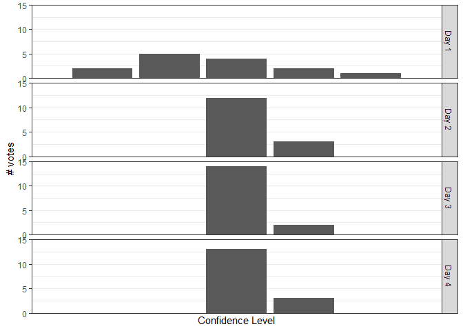
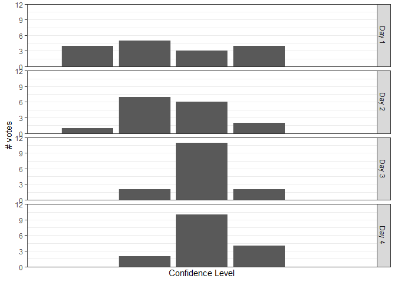
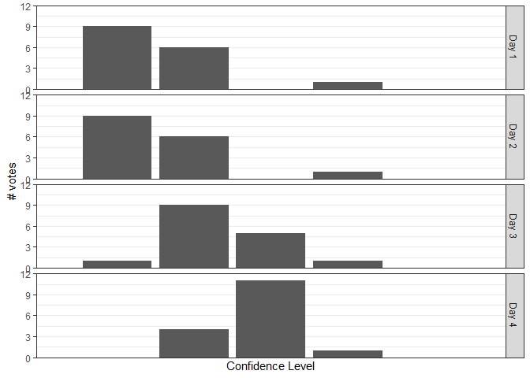

Self Assesment
================
Marc Vaudel
2019-10-28

# How confident do you feel with…

### critically reading a proteomics paper?

<!-- -->

### interpreting proteomics data?

<!-- -->

### contextualizing data with biomedical knowledge?

<!-- -->

### in jointly analyzing proteomics with other omics data (esp. genomics)?

<!-- -->
