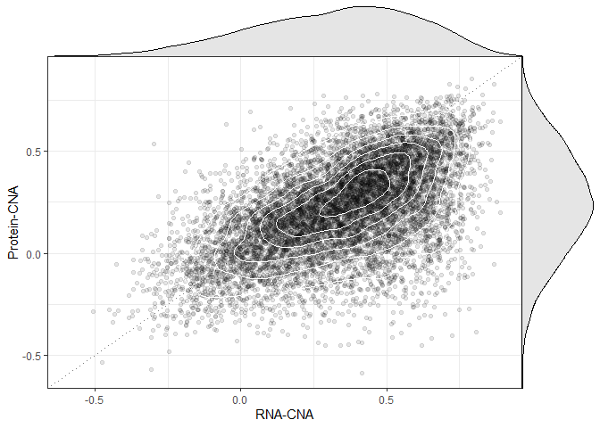
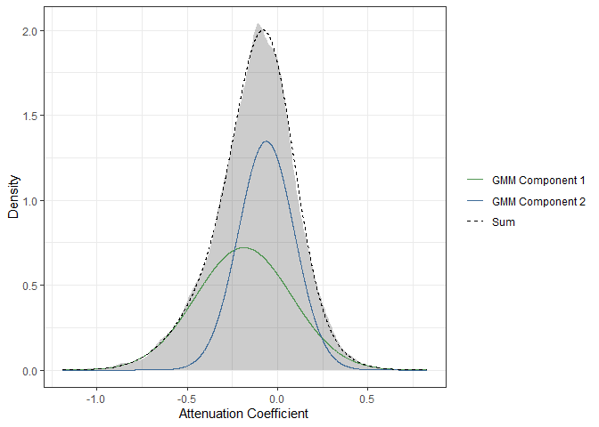
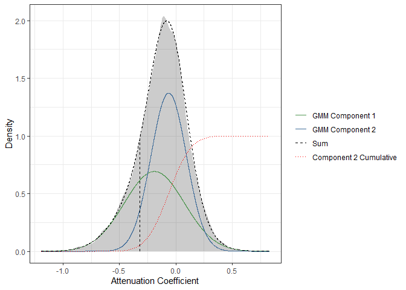

CNA-Protein
================
Marc Vaudel
2019-10-28

# CNA-Protein

In the previous chapters, we investigated the presence of novel or
variant peptides in Breast cancer tumors as done by Johansson *et al.*
[(1)](#references) using a proteogenomic search strategy. Here, we look
at the effect of copy number alteration (CNA). Copy number variation is
associated with increased or decreased gene expression, but the
association with protein abundances is less pronounced, one says that
the effect of CNAs is post-translationally attenuated
[(1,2)](#references).

##### :speech\_balloon: In you opinion, what mechanisms can affect the association between CNA, gene expression, and protein abundances?

## Libraries

We will need the following libraries, please make sure that they are
installed.

``` r
library(conflicted)
library(tidyr)
library(dplyr)
library(ggplot2)
library(scico)
library(gtable)
library(grid)
library(mclust)

conflict_prefer("filter", "dplyr")

theme_set(theme_bw(base_size = 11))
```

## CNA - RNA - Protein abundance relationship

Johansson *et al.* [(1)](#references) conduct a correlation analysis
similar to Gonçalves *et al.* [(3)](#references), where the correlation
of protein abundances with CNA is compared to the correlation of RNA
levels with CNA. These values are provided in [Supplementary Table
5](../resources/Johansson_et_al_breast_cancer_quantitative_proteome_and_proteogenomic_landscape).
The correlation values were extracted in R-friendly format and are
availabe in
[resources/data/cna-rna-protein](resources/data/cna-rna-protein).

##### :pencil2: Import the correlation results.

``` r
# Load the file, select the columns of interest, format the columns and content

cnaCorDF <- read.table(
    file = "resources/data/cna-rna-protein",
    header = T,
    sep = "\t",
    comment.char = "",
    quote = "",
    stringsAsFactors = F
)
```

##### [:thought\_balloon:](answers.md#thought_balloon-what-do-the-columns-represent-what-is-the-difference-between-pearson-and-spearman-correlations) What do the columns represent? What is the difference between Pearson and Spearman correlations?

##### :pencil2: Plot the correlation results for proteins against mRNA as in Figure 6 of Johansson *et al.* [(1)](#references) and Figure 1 of Gonçalves *et al.* [(3)](#references).

``` r
# Build the scatter plot

axisMin <- min(c(cnaCorDF$mRNA_Spearman_correlation, cnaCorDF$protein_Spearman_correlation))
axisMax <- max(c(cnaCorDF$mRNA_Spearman_correlation, cnaCorDF$protein_Spearman_correlation))

scatterPlot <- ggplot(
    data = cnaCorDF
) +
    geom_abline(
        slope = 1,
        intercept = 0,
        linetype = "dotted",
        col = "black",
        alpha = 0.5
    ) +
    geom_point(
        mapping = aes(
            x = mRNA_Spearman_correlation,
            y = protein_Spearman_correlation
        ),
        col = "black",
        alpha = 0.1
    ) +
    geom_density_2d(
        mapping = aes(
            x = mRNA_Spearman_correlation,
            y = protein_Spearman_correlation
        ),
        col = "white",
    ) +
    scale_x_continuous(
        name = "RNA-CNA",
        limits = c(axisMin, axisMax)
    ) +
    scale_y_continuous(
        name = "Protein-CNA",
        limits = c(axisMin, axisMax)
    ) +
    theme(
        legend.position = "none"
    )


# Build the density plots

rnaDensityPlot <- ggplot(
    data = cnaCorDF
) + theme_minimal() + 
    geom_density(
        mapping = aes(
            x = mRNA_Spearman_correlation
        ),
        fill = "black",
        alpha = 0.1
    ) +
    scale_x_continuous(
        expand = c(0, 0)
    ) +
    scale_y_continuous(
        expand = c(0, 0)
    ) +
    theme(
        axis.title = element_blank(),
        axis.text = element_blank(),
        panel.grid = element_blank()
    )

proteinDensityPlot <- ggplot(
    data = cnaCorDF
) + theme_minimal() + 
    geom_density(
        mapping = aes(
            x = protein_Spearman_correlation
        ),
        fill = "black",
        alpha = 0.1
    ) +
    scale_x_continuous(
        expand = c(0, 0)
    ) +
    scale_y_continuous(
        expand = c(0, 0)
    ) +
    theme(
        axis.title = element_blank(),
        axis.text = element_blank(),
        panel.grid = element_blank()
    ) + 
    coord_flip()


# Make grobs from plots

scatterGrob <- ggplotGrob(scatterPlot)
rnaDensityGrob <- ggplotGrob(rnaDensityPlot)
proteinDensityGrob <- ggplotGrob(proteinDensityPlot)


# Insert the densities as new row and column in the scatter grob

mergedGrob <- rbind(scatterGrob[1:6, ], rnaDensityGrob[7, ], scatterGrob[7:nrow(scatterGrob), ], size = "last")
mergedGrob$heights[7] <- unit(0.15, "null")

proteinDensityGrob <- gtable_add_rows(
    x = proteinDensityGrob, 
    heights = unit(rep(0, nrow(mergedGrob) - nrow(proteinDensityGrob)), "null"), 
    pos = 0
)

mergedGrob <- cbind(mergedGrob[, 1:5], proteinDensityGrob[, 5], mergedGrob[, 6:ncol(mergedGrob)], size = "first")
mergedGrob$widths[6] <- unit(0.15, "null")


# Plot

grid.draw(mergedGrob)
```

<!-- -->

##### :speech\_balloon: How can we categorize CNAs in tumors based on this plot?

Gonçalves *et al.* [(3)](#references) define the attenuation coefficient
as the difference between the correlation of the transcript and protein
levels with the CNA, where a positive and negative coefficient indicate
a lower and higher correlation at the protein level, respectively.

##### :pencil2: Estimate the attenuation coefficient and plot its density.

``` r
# Attenuation coefficient

cnaCorDF <- cnaCorDF %>%
    mutate(
        attenuation_coefficient = protein_Spearman_correlation - mRNA_Spearman_correlation
    )


# Build density plot

ggplot(
    data = cnaCorDF
) +
    geom_density(
        mapping = aes(
            x = attenuation_coefficient
        ),
        fill = "black",
        alpha = 0.2
    ) +
    scale_x_continuous(
        name = "Attenuation Coefficient"
    ) +
    scale_y_continuous(
        name = "Density"
    )
```

<!-- -->

The authors suggest that this distribution is the combination of two
populations of CNAs: post-translationally attenuated and not. They model
the distributions of the two populations using Gaussian mixture
modelling, where the overall density is decomposed into the sum of
densities from Gaussian distributions.

##### :pencil2: Run Gaussian mixture modelling on the attenuation coefficient.

``` r
gmm <- densityMclust(cnaCorDF$attenuation_coefficient)

summary(gmm, parameters = TRUE)
```

    ## ------------------------------------------------------- 
    ## Density estimation via Gaussian finite mixture modeling 
    ## ------------------------------------------------------- 
    ## 
    ## Mclust V (univariate, unequal variance) model with 2 components: 
    ## 
    ##  log-likelihood    n df      BIC       ICL
    ##         935.404 9533  5 1824.995 -5860.316
    ## 
    ## Mixing probabilities:
    ##         1         2 
    ## 0.4609893 0.5390107 
    ## 
    ## Means:
    ##           1           2 
    ## -0.19046910 -0.06295614 
    ## 
    ## Variances:
    ##          1          2 
    ## 0.07058981 0.02456033

##### [:thought\_balloon:](answers.md#thought_balloon-what-do-the-columns-represent-what-is-the-difference-between-pearson-and-spearman-correlations) How many gaussian distributions were suggested by the model? What do the *Mixing probabilities*, *Means*, and *Variances* represent?

##### [:thought\_balloon:](answers.md#thought_balloon-what-do-the-columns-represent-what-is-the-difference-between-pearson-and-spearman-correlations) Based on this, how many CNAs are considered attenuated?

##### :pencil2: Overlay the density and the model.

``` r
# Density from first component

gmm_density_1 <- gmm$parameters$pro[1] * dnorm(
    x = cnaCorDF$attenuation_coefficient, 
    mean = gmm$parameters$mean[1], 
    sd = sqrt(gmm$parameters$variance$sigmasq[1])
)

# Density from second component

gmm_density_2 <- gmm$parameters$pro[2] * dnorm(
    x = cnaCorDF$attenuation_coefficient, 
    mean = gmm$parameters$mean[2], 
    sd = sqrt(gmm$parameters$variance$sigmasq[2])
)

# Sum

gmm_density_sum <- gmm_density_1 + gmm_density_2


# Gather densities in a data frame

plotDF <- data.frame(
    x = c(
        rep(
            x = cnaCorDF$attenuation_coefficient,
            3
        )
    ),
    y = c(
        gmm_density_1,
        gmm_density_2,
        gmm_density_sum
    ),
    category = factor(
        x = c(rep("GMM Component 1", nrow(cnaCorDF)), rep("GMM Component 2", nrow(cnaCorDF)), rep("Sum", nrow(cnaCorDF))),
        levels = c("GMM Component 1", "GMM Component 2", "Sum")
    )
)

# Build overlayed density plot

ggplot() +
    geom_density(
        data = cnaCorDF,
        mapping = aes(
            x = attenuation_coefficient
        ),
        fill = "black",
        col = NA,
        alpha = 0.2
    ) +
    geom_line(
        data = plotDF,
        mapping = aes(
            x = x,
            y = y,
            col = category,
            linetype = category
        )
    ) +
    scale_x_continuous(
        name = "Attenuation Coefficient"
    ) +
    scale_y_continuous(
        name = "Density"
    ) +
    scale_color_manual(
        values = c(
            scico(
                n = 2,
                palette = "cork",
                begin = 0.2,
                end = 0.8,
                direction = -1
            ),
            "black"
        )
    ) +
    scale_linetype_manual(
        values = c(
            "solid",
            "solid",
            "dashed"
        )
    ) +
    theme(
        legend.title = element_blank()
    )
```

<!-- -->

##### [:thought\_balloon:](answers.md#thought_balloon-what-do-the-columns-represent-what-is-the-difference-between-pearson-and-spearman-correlations) Which component represents the attenuated distribution? How can we classify CNAs based on these distributions?

##### :speech\_balloon: What do you think of the quality of the modelling?

In the following, we use the cumulative distribution function of the
second component to scale the attenuation coefficient, and use the
biologists’ favorite threshold of 0.05 to highlight the confidently
attenuated CNAs.

##### :pencil2: Scale the attenuation coefficient.

``` r
# Scale the attenuation coefficient

cnaCorDF$attenuation_p <- pnorm(
    q = cnaCorDF$attenuation_coefficient,
    mean = gmm$parameters$mean[2],
    sd = sqrt(gmm$parameters$variance$sigmasq[2])
)


# Threshold at 0.05

cnaCorDF$attenuation_category <- factor(
    x = ifelse(cnaCorDF$attenuation_p <= 0.05, "Attenuated", "Background"),
    levels = c("Attenuated", "Background")
)


# Gather densities in a data frame

plotDF <- data.frame(
    x = c(
        rep(
            x = cnaCorDF$attenuation_coefficient,
            4
        )
    ),
    y = c(
        gmm_density_1,
        gmm_density_2,
        gmm_density_sum,
        cnaCorDF$attenuation_p
    ),
    category = factor(
        x = c(rep("GMM Component 1", nrow(cnaCorDF)), rep("GMM Component 2", nrow(cnaCorDF)), rep("Sum", nrow(cnaCorDF)), rep("Component 2 Cumulative", nrow(cnaCorDF))),
        levels = c("GMM Component 1", "GMM Component 2", "Sum", "Component 2 Cumulative")
    )
)

# Build overlayed density plot

xThreshold <- qnorm(
    p = 0.05,
    mean = gmm$parameters$mean[2],
    sd = sqrt(gmm$parameters$variance$sigmasq[2])
)
yThreshold <- gmm$parameters$pro[1] * dnorm(
    x = xThreshold, 
    mean = gmm$parameters$mean[1], 
    sd = sqrt(gmm$parameters$variance$sigmasq[1])
) +  gmm$parameters$pro[2] * dnorm(
    x = xThreshold, 
    mean = gmm$parameters$mean[2], 
    sd = sqrt(gmm$parameters$variance$sigmasq[2])
)

ggplot() +
    geom_density(
        data = cnaCorDF,
        mapping = aes(
            x = attenuation_coefficient
        ),
        fill = "black",
        col = NA,
        alpha = 0.2
    ) +
    geom_line(
        data = plotDF,
        mapping = aes(
            x = x,
            y = y,
            col = category,
            linetype = category
        )
    ) +
    geom_segment(
        mapping = aes(
            x = xThreshold,
            xend = xThreshold,
            y = 0,
            yend = yThreshold
        ),
            linetype = "dashed"
    ) +
    scale_x_continuous(
        name = "Attenuation Coefficient"
    ) +
    scale_y_continuous(
        name = "Density"
    ) +
    scale_color_manual(
        values = c(
            scico(
                n = 2,
                palette = "cork",
                begin = 0.2,
                end = 0.8,
                direction = -1
            ),
            "black",
            "red"
        )
    ) +
    scale_linetype_manual(
        values = c(
            "solid",
            "solid",
            "dashed",
            "dotted"
        )
    ) +
    theme(
        legend.title = element_blank()
    )
```

<!-- -->

## References

1)  [Breast cancer quantitative proteome and proteogenomic
    landscape](https://www.ncbi.nlm.nih.gov/pubmed/30962452)

2)  [The genomic and transcriptomic architecture of 2,000 breast tumours
    reveals novel
    subgroups](https://www.ncbi.nlm.nih.gov/pubmed/22522925)

3)  [Widespread Post-transcriptional Attenuation of Genomic Copy-Number
    Variation in Cancer](https://www.ncbi.nlm.nih.gov/pubmed/29032074)
