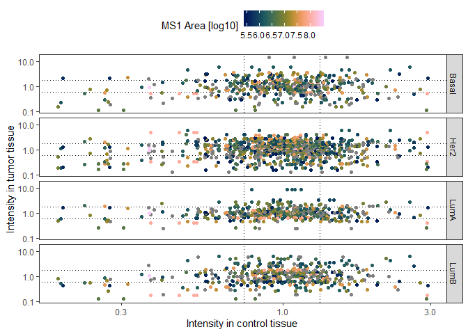

Novel Peptides
================
Marc Vaudel
2019-10-28

# 1\. Novel Peptides

Mutations in the genome can alter the sequence so that non-coding
sections become coding. *e.g.* through the introduction of a start codon
or the alteration of a stop codon. In order to identify these
non-canonical genomic products, protein databases that capture genetic
variation and non-canonical genomic products are generated either by
enriching canonical protein sequences or by running six reading frame
translation of the entire genome
[(1)](#references).

##### [:thought\_balloon:](answers.md#thought_balloon-based-on-you-knowledge-of-peptide-and-protein-identification-can-you-anticipate-challenges-posed-by-these-proteogenomic-databases) *Based on you knowledge of peptide and protein identification, can you anticipate challenges posed by these proteogenomic databases?*

## Processing

This tutorial is a notebook that contains [R](r-project.org) code that
can be run directly from the *Rmd* file. It assumes that the R working
directory is the proteogenomics folder of the repository, *e.g.*
`/myfolder/IBIP19/pages/proteogenomics`. We recommend using RStudio to
run this tutorial.

## Libraries

You will need the following libraries, please make sure that they are
installed.

``` r
library(tidyr)
library(dplyr)
library(ggplot2)
library(scico)

theme_set(theme_bw(base_size = 11))
```

  - We will use [tidyr](tidyr.tidyverse.org) to import data, we
    recommend this [cheat
    sheet](https://github.com/rstudio/cheatsheets/blob/master/data-import.pdf).
  - We will use [dplyr](dplyr.tidyverse.org) to transform data, we
    recommend this [cheat
    sheet](https://github.com/rstudio/cheatsheets/blob/master/data-transformation.pdf).
  - We will use [ggplot2](ggplot2.tidyverse.org) to plot data, we
    recommend this [cheat
    sheet](https://github.com/rstudio/cheatsheets/blob/master/data-visualization-2.1.pdf).
  - We will use [scico](https://github.com/thomasp85/scico) for color
    palette. Scico is based on [Scientific
    Colour-Maps](http://www.fabiocrameri.ch/colourmaps.php) that are
    perceptually uniform, perceptually ordered, colour-vision-deficiency
    friendly, readable as black-and-white print, and therefore perfectly
    suited for scientific illustrations.

## Data set

In this tutorial, we will analyze the non-canonical genomic products
identified in breast cancer by Johansson *et al.* [(2)](#references).
Note that this tutorial does not cover the database generation, search,
and validation of identification results. These bioinformatic procedures
are very demanding and we strongly advise to make sure that they are in
place at your lab or at the facility processing the data before
conducting any proteogenomic experiment. The proteogenomic
identification results by Johansson *et al.* [(2)](#references) are
reported in Supplementary Data 6, available
[here](../resources/Johansson_et_al_breast_cancer_quantitative_proteome_and_proteogenomic_landscape)
in the course
repository.

##### [:thought\_balloon:](answers.md#thought_balloon-what-do-the-different-columns-in-the-table-represent) *What do the different columns in the table represent?*

For this tutorial, the *Novel Peptides* table was extracted to an
R-friendly text format, and is available in
[resources/data/novel\_peptides.txt](resources/data/novel_peptides.txt).

##### :pencil2: Load the data in R as in the code below.

``` r
novelPeptidesDF <- read.table(
    file = "resources/data/novel_peptides.txt",
    header = T,
    sep = "\t",
    comment.char = "",
    stringsAsFactors = F
)
```

## Genomic context and function

##### :pencil2: Find the different classes of loci represented.

``` r
classesDF <- as.data.frame(
    table(
        novelPeptidesDF$class
    )
) %>%
    rename(
        class = Var1,
        n_peptides = Freq
    ) %>%
    arrange(
        desc(n_peptides)
    )

knitr::kable(classesDF)
```

| class                    | n\_peptides |
| :----------------------- | ----------: |
| intergenic               |         172 |
| intronic                 |          91 |
| ncRNA\_intronic          |          22 |
| ncRNA\_exonic            |          18 |
| exonic                   |          17 |
| UTR5                     |          16 |
| UTR5-exonic              |          14 |
| exonic-UTR5              |          12 |
| intronic-exonic          |          10 |
| exonic-intronic          |           4 |
| upstream                 |           3 |
| exonic-ncRNA\_exonic     |           2 |
| exonic-splicing          |           1 |
| exonic-upstream          |           1 |
| intergenic-ncRNA\_exonic |           1 |
| ncRNA\_exonic-exonic     |           1 |
| splicing-intronic        |           1 |
| UTR3                     |           1 |
| UTR5-upstream            |           1 |

##### [:thought\_balloon:](answers.md#thought_balloon-can-you-speculate-on-how-these-different-classes-of-loci-can-yield-detectable-peptides) *Can you speculate on how these different classes of loci can yield detectable peptides?*

##### :pencil2: For the non-intergenic peptides, find the different categories of associated genes.

``` r
novelPeptidesDF %>% 
    filter(
        class != "intergenic"
    ) %>%
    select(
        nearest_gene, category
    ) -> geneDF

categoriesDF <- as.data.frame(
    table(
        geneDF$category
    )
) %>%
    rename(
        category = Var1,
        n_peptides = Freq
    ) %>%
    arrange(
        desc(n_peptides)
    )

knitr::kable(categoriesDF)
```

| category        | n\_peptides |
| :-------------- | ----------: |
| pseudogene      |          93 |
| 5UTR            |          43 |
| intronic        |          33 |
| exonic.Alt.ORF  |          18 |
| exon\_extension |          14 |
| ncRNA           |          12 |
| intergenic      |           2 |
| 3UTR            |           1 |

##### [:thought\_balloon:](answers.md#thought_balloon-what-do-these-categories-represent) *What do these categories represent?*

##### :pencil2: Select peptides from the different classes and categories, and inspect the genetic landscape at these positions using the Ensembl or UCSC genome browsers. [Example for locus \#9 (Intronic)](https://grch37.ensembl.org/Homo_sapiens/Location/View?r=1:51913622-51913666)

##### :pencil2: Select genes possibly influenced by the transcription/translation change and inspect the function of the associated proteins.

## Abundance in tumors and normal tissue

In [Supplementary Table
8](../resources/Johansson_et_al_breast_cancer_quantitative_proteome_and_proteogenomic_landscape),
the authors provide the abundance for novel peptides monitored in normal
tissue and tumors for five patients. The table was extracted to an
R-friendly text format for this tutorial, and is available in
[resources/data/novel\_peptides\_paired.txt](resources/data/novel_peptides_paired.txt).

##### :pencil2: Load the data in R as done for the previous table. In addition, transform the data from wide to long format and create columns indicating the patient number, whether the sample is *Control* or *Tumor*, and what kind of tumor, as done in the code below.

``` r
novelPeptidesDF <- read.table(
    file = "resources/data/novel_peptides_paired.txt",
    header = T,
    sep = "\t",
    comment.char = "",
    stringsAsFactors = F
) %>% 
    gather(
        "Control_1", "Control_2", "Control_3", "Control_4", "Control_5",
        key = "control_id",
        value = "control"
    ) %>% 
    select(
        -control_id
    ) %>%
    gather(
        "LumA_1", "Her2_2", "LumB_3", "Basal_4", "Her2_5",
        key = "tumor_id",
        value = "tumor"
    ) %>%
    separate(
        col = "tumor_id",
        into = c("tumorType", "patientNumber"),
        sep = "_"
    ) %>%
    mutate(
        patientId = paste("Patient", patientNumber)
    )
```

##### :pencil2: Plot the peptide abundance in the tumor *vs* control tissue for all peptides and all patients.

``` r
ggplot(
    data = novelPeptidesDF
) +
    geom_hline(
        yintercept = quantile(
            x = novelPeptidesDF$tumor, 
            probs = c(0.2, 0.8),
            na.rm = T
        ),
        col = "black",
        linetype = "dotted"
    ) +
    geom_vline(
        xintercept = quantile(
            x = novelPeptidesDF$control, 
            probs = c(0.2, 0.8),
            na.rm = T
        ),
        col = "black",
        linetype = "dotted"
    ) +
    geom_point(
        mapping = aes(
            x = control,
            y = tumor,
            col = log10(ms1_area)
        )
    ) +
    facet_grid(
        tumorType ~ .
    ) +
    scale_x_log10(
        name = "Intensity in control tissue"
    ) +
    scale_y_log10(
        name = "Intensity in tumor tissue"
    ) + 
    scale_color_scico(
        name = "MS1 Area [log10]",
        palette = "batlow"
    ) +
    theme(
        legend.position = "top",
        panel.grid = element_blank()
    )
```

    ## Warning: Removed 95 rows containing missing values (geom_point).

<!-- -->

##### :speech\_balloon: How do you interpret this plot?

## Conclusion

##### :speech\_balloon: Can you speculate on the function or effect of these novel peptides in cancer biology? How can these be used in a clinical setup?

## References

1)  [Proteogenomics: concepts, applications and computational
    strategies](https://www.ncbi.nlm.nih.gov/pubmed/25357241)

2)  [Breast cancer quantitative proteome and proteogenomic
    landscape](https://www.ncbi.nlm.nih.gov/pubmed/30962452)
