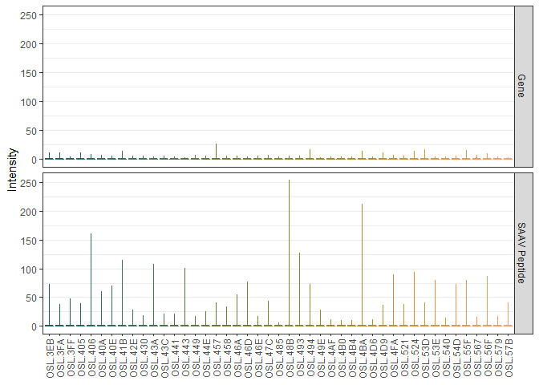
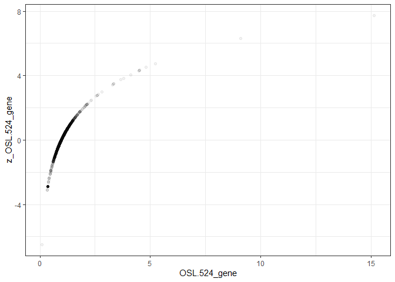
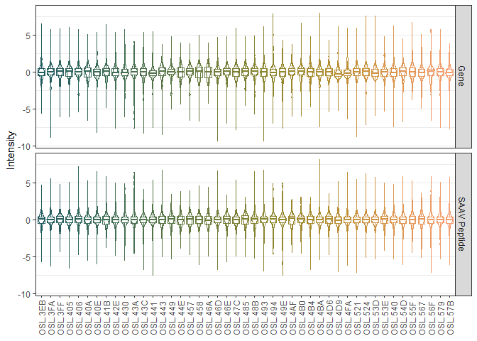

Variation Analysis
================
Marc Vaudel
2019-10-28

# 1\. Variation Analysis

In the [previous chapter](novel_peptides.md), novel peptides were
identified by Johansson *et al.* [(1)](#references) using a
proteogenomic search strategy. In addition, this search allowed
identifying peptides presenting single amino acid variants (SAAV).

## Libraries

We will need the following libraries, please make sure that they are
installed.

``` r
library(tidyr)
library(dplyr)
library(ggplot2)
library(scico)
library(gamlss)
library(conflicted)

theme_set(theme_bw(base_size = 11))

conflict_prefer("filter", "dplyr")
conflict_prefer("select", "dplyr")
```

## Genotype - peptide abundance relationship

Figure 7h displays the intensity of peptides produced by the reference
and alternative alleles of corresponding SNPs for each genotype.


> Figure 7h in Johansson *et al.*
[(1)](#references).

##### [:thought\_balloon:](answers.md#thought_balloon-if-we-assume-a-linear-relationship-between-number-of-alleles-and-peptide-abundance-what-should-be-the-peptide-distribution-for-each-genotype) *If we assume a linear relationship between number of alleles and peptide abundance, what should be the peptide distribution for each genotype?*

Note that the genotyping data corresponding to the peptide intensities
were not made available, but more examples can be found in
[Supplementary Figure
15](../resources/Johansson_et_al_breast_cancer_quantitative_proteome_and_proteogenomic_landscape/supplementary_information.pdf).

##### :speech\_balloon: Do the results presented follow a linear trend? What can affect the linearity of the relationship between number of alleles and intensity distribution?

## Abundance of variant peptides relative to the proteins

In [Supplementary Table
1](../resources/Johansson_et_al_breast_cancer_quantitative_proteome_and_proteogenomic_landscape)
and [Supplementary Table
6](../resources/Johansson_et_al_breast_cancer_quantitative_proteome_and_proteogenomic_landscape),
the authors provide the results of their proteogenomic analysis for
genes and for peptides carrying alternative alleles of SAAVs,
respectively. In addition, [Supplementary Table
1](../resources/Johansson_et_al_breast_cancer_quantitative_proteome_and_proteogenomic_landscape)
contains experimental design and sample characterization information.
The tables were extracted to an R-friendly text format for this
tutorial, and are available in
[resources/data/tumor.gz](resources/data/tumor.gz),
[resources/data/proteins.gz](resources/data/proteins.gz), and
[resources/data/saav.gz](resources/data/saav.gz).

##### :pencil2: Load the data in R as in the code below.

``` r
tumorDF <- read.table(
    file = "resources/data/tumor.gz",
    header = T,
    sep = "\t",
    comment.char = "",
    quote = "",
    stringsAsFactors = F
)

genesDF <- read.table(
    file = "resources/data/genes.gz",
    header = T,
    sep = "\t",
    comment.char = "",
    quote = "",
    stringsAsFactors = F
) %>%
    select(
        -contains("nspsm")
    )

saavDF <- read.table(
    file = "resources/data/saav.gz",
    header = T,
    sep = "\t",
    comment.char = "",
    quote = "",
    stringsAsFactors = F
)
```

Note that for the sake of speed, the last columns of the genes table
were
skipped.

##### [:thought\_balloon:](answers.md#thought_balloon-how-do-we-need-to-transform-the-tables-to-compare-saav-peptide-level-intensities-to-gene-level-intensities) *How do we need to transform the tables to compare SAAV peptide-level intensities to gene-level intensities?*

For the sake of time, this data transformation was run for you already.
The proposed solution is available in
[scripts/merge\_table\_1\_6.R](resources/data/saav.gz), and the
reformated SAAV peptides table is available in
[resources/data/table16.gz](resources/data/table16.gz). Note that in
this table one row represents a unique {peptide sequence, gene
accession}
pair.

##### [:thought\_balloon:](answers.md#thought_balloon-how-do-we-need-to-transform-the-tables-to-compare-saav-peptide-level-intensities-to-gene-level-intensities) *Why can there be multiple peptide per gene, and gene per peptide? Is it correct to represent peptides by their sequence?*

##### :pencil2: Load the reformated SAAV peptides table.

``` r
saavDF <- read.table(
    file = "resources/data/table16.gz",
    header = T,
    sep = "\t",
    comment.char = "",
    quote = "",
    stringsAsFactors = F
)

tumorColumns <- c("OSL.53E_saavPeptide", "OSL.53E_gene", "OSL.567_saavPeptide", "OSL.567_gene", "OSL.3FF_saavPeptide", "OSL.3FF_gene", "OSL.55F_saavPeptide", "OSL.55F_gene", "OSL.46A_saavPeptide", "OSL.46A_gene", "OSL.4B0_saavPeptide", "OSL.4B0_gene", "OSL.4D6_saavPeptide", "OSL.4D6_gene", "OSL.485_saavPeptide", "OSL.485_gene", "OSL.41B_saavPeptide", "OSL.41B_gene", "OSL.4AF_saavPeptide", "OSL.4AF_gene", "OSL.46E_saavPeptide", "OSL.46E_gene", "OSL.494_saavPeptide", "OSL.494_gene", "OSL.457_saavPeptide", "OSL.457_gene", "OSL.48B_saavPeptide", "OSL.48B_gene", "OSL.4B4_saavPeptide", "OSL.4B4_gene", "OSL.449_saavPeptide", "OSL.449_gene", "OSL.44E_saavPeptide", "OSL.44E_gene", "OSL.3EB_saavPeptide", "OSL.3EB_gene", "OSL.43C_saavPeptide", "OSL.43C_gene", "OSL.493_saavPeptide", "OSL.493_gene", "OSL.4D9_saavPeptide", "OSL.4D9_gene", "OSL.56F_saavPeptide", "OSL.56F_gene", "OSL.405_saavPeptide", "OSL.405_gene", "OSL.49E_saavPeptide", "OSL.49E_gene", "OSL.441_saavPeptide", "OSL.441_gene", "OSL.430_saavPeptide", "OSL.430_gene", "OSL.4FA_saavPeptide", "OSL.4FA_gene", "OSL.43A_saavPeptide", "OSL.43A_gene", "OSL.406_saavPeptide", "OSL.406_gene", "OSL.47C_saavPeptide", "OSL.47C_gene", "OSL.524_saavPeptide", "OSL.524_gene", "OSL.443_saavPeptide", "OSL.443_gene", "OSL.458_saavPeptide", "OSL.458_gene", "OSL.53D_saavPeptide", "OSL.53D_gene", "OSL.540_saavPeptide", "OSL.540_gene", "OSL.42E_saavPeptide", "OSL.42E_gene", "OSL.40A_saavPeptide", "OSL.40A_gene", "OSL.40E_saavPeptide", "OSL.40E_gene", "OSL.3FA_saavPeptide", "OSL.3FA_gene", "OSL.521_saavPeptide", "OSL.521_gene", "OSL.46D_saavPeptide", "OSL.46D_gene", "OSL.54D_saavPeptide", "OSL.54D_gene", "OSL.4BA_saavPeptide", "OSL.4BA_gene", "OSL.579_saavPeptide", "OSL.579_gene", "OSL.57B_saavPeptide", "OSL.57B_gene")
```

##### :pencil2: Plot the intensity distributions as violin and box plots for the different tumors

``` r
intensitiesDF <- saavDF %>%
    gather(
        !!tumorColumns,
        key = "sample",
        value = "intensity"
    ) %>%
    filter(
        !is.na(intensity) & !is.infinite(intensity)
    ) %>%
    separate(
        col = sample,
        into = c("tumor", "species"),
        sep = "_"
    )

intensitiesDF$species <- factor(
    intensitiesDF$species, 
    levels = c("gene", "saavPeptide")
)
levels(intensitiesDF$species) <- c("Gene", "SAAV Peptide")

ggplot(
    data = intensitiesDF
) +
    geom_violin(
        mapping = aes(
            x = tumor,
            y = intensity,
            col = tumor
        ),
        fill = NA
    ) +
    geom_boxplot(
        mapping = aes(
            x = tumor,
            y = intensity,
            col = tumor
        ),
        fill = NA,
        outlier.shape = NA
    ) +
    facet_grid(
        species ~ .
    ) + 
    scale_fill_manual(
        values = scico(
            n = length(unique(intensitiesDF$tumor)),
            palette = "batlow",
            begin = 0.25,
            end = 0.75
        )
    ) +
    scale_color_manual(
        values = scico(
            n = length(unique(intensitiesDF$tumor)),
            palette = "batlow",
            begin = 0.25,
            end = 0.75
        )
    ) + 
    scale_y_continuous(
        name = "Intensity"
    ) + 
    theme(
        legend.position = "none",
        axis.title.x = element_blank(),
        axis.text.x = element_text(
            angle = 90,
            hjust = 1,
            vjust = 0.5
            
        ),
        panel.grid.major.x = element_blank(),
        panel.grid.minor.x = element_blank()
    )
```

<!-- -->

##### [:thought\_balloon:](answers.md#thought_balloon-why-are-all-intensities-at-the-bottom-how-can-we-better-visualize-these-distributions) *Why are all intensities at the bottom? How can we better visualize these distributions?*

As you can see, the gene-level intensities are centered around one, and
not for the peptide-level. You might have noticed in the paper that the
gene-level data as provided in the supplementary information are
centered, but this was not done for the
peptides.

##### :speech\_balloon: In your opinion why were the protein data centered? How would you recommend normalizing these data? Why?

Here, we hypothesize that SAAV peptides are sampled from these genes and
should therefore present the same abundance distribution. Data
acquisition and processing artefacts can influence the centering and
scaling. To correct for this, we will normalize the abundances from all
tumors using centile-based Z-scores.

``` r
for (column in tumorColumns) {
    
    zColumn <- paste0("z_", column)
    
    trainingDF <- saavDF %>%
        filter(
            !is.na(!!sym(column)) & !is.infinite(!!sym(column)) & !!sym(column) > 0
        ) %>%
        select(
            gene, peptide_sequence, !!column
        )
    
    trainingDF$x <- 0 # Note that it is possible to include covariates in the model instead of using a constant here
    
    model <- gamlss(
        formula = as.formula(paste0(column, " ~ x")),
        family = LOGNO,
        data = trainingDF,
        
    )
    
    trainingDF[[zColumn]] <- centiles.pred(
        obj = model, 
        xname = "x", 
        xvalues = trainingDF$x, 
        yval = trainingDF[[column]], 
        type = "z-scores"
    )
    
    trainingDF <- trainingDF %>%
        select(
            gene, peptide_sequence, !!zColumn
        )
    
    saavDF <- saavDF %>%
        left_join(
            trainingDF,
            by = c("gene", "peptide_sequence")
        )
    
}
```

    ## GAMLSS-RS iteration 1: Global Deviance = 2264.447 
    ## GAMLSS-RS iteration 2: Global Deviance = 2264.447 
    ## GAMLSS-RS iteration 1: Global Deviance = 2077.346 
    ## GAMLSS-RS iteration 2: Global Deviance = 2077.346 
    ## GAMLSS-RS iteration 1: Global Deviance = 1481.316 
    ## GAMLSS-RS iteration 2: Global Deviance = 1481.316 
    ## GAMLSS-RS iteration 1: Global Deviance = 3196.276 
    ## GAMLSS-RS iteration 2: Global Deviance = 3196.276 
    ## GAMLSS-RS iteration 1: Global Deviance = 2027.347 
    ## GAMLSS-RS iteration 2: Global Deviance = 2027.347 
    ## GAMLSS-RS iteration 1: Global Deviance = 393.7306 
    ## GAMLSS-RS iteration 2: Global Deviance = 393.7306 
    ## GAMLSS-RS iteration 1: Global Deviance = 2032.55 
    ## GAMLSS-RS iteration 2: Global Deviance = 2032.55 
    ## GAMLSS-RS iteration 1: Global Deviance = 2816.031 
    ## GAMLSS-RS iteration 2: Global Deviance = 2816.031 
    ## GAMLSS-RS iteration 1: Global Deviance = 2209.422 
    ## GAMLSS-RS iteration 2: Global Deviance = 2209.422 
    ## GAMLSS-RS iteration 1: Global Deviance = 3725.461 
    ## GAMLSS-RS iteration 2: Global Deviance = 3725.461 
    ## GAMLSS-RS iteration 1: Global Deviance = 2129.542 
    ## GAMLSS-RS iteration 2: Global Deviance = 2129.542 
    ## GAMLSS-RS iteration 1: Global Deviance = 80.1345 
    ## GAMLSS-RS iteration 2: Global Deviance = 80.1345 
    ## GAMLSS-RS iteration 1: Global Deviance = 1750.882 
    ## GAMLSS-RS iteration 2: Global Deviance = 1750.882 
    ## GAMLSS-RS iteration 1: Global Deviance = 2265.483 
    ## GAMLSS-RS iteration 2: Global Deviance = 2265.483 
    ## GAMLSS-RS iteration 1: Global Deviance = 1619.658 
    ## GAMLSS-RS iteration 2: Global Deviance = 1619.658 
    ## GAMLSS-RS iteration 1: Global Deviance = 1350.304 
    ## GAMLSS-RS iteration 2: Global Deviance = 1350.304 
    ## GAMLSS-RS iteration 1: Global Deviance = 1730.315 
    ## GAMLSS-RS iteration 2: Global Deviance = 1730.315 
    ## GAMLSS-RS iteration 1: Global Deviance = 3128.811 
    ## GAMLSS-RS iteration 2: Global Deviance = 3128.811 
    ## GAMLSS-RS iteration 1: Global Deviance = 1542.748 
    ## GAMLSS-RS iteration 2: Global Deviance = 1542.748 
    ## GAMLSS-RS iteration 1: Global Deviance = 2791.137 
    ## GAMLSS-RS iteration 2: Global Deviance = 2791.137 
    ## GAMLSS-RS iteration 1: Global Deviance = 1481.33 
    ## GAMLSS-RS iteration 2: Global Deviance = 1481.33 
    ## GAMLSS-RS iteration 1: Global Deviance = 2275.306 
    ## GAMLSS-RS iteration 2: Global Deviance = 2275.306 
    ## GAMLSS-RS iteration 1: Global Deviance = 1583.872 
    ## GAMLSS-RS iteration 2: Global Deviance = 1583.872 
    ## GAMLSS-RS iteration 1: Global Deviance = 2457.926 
    ## GAMLSS-RS iteration 2: Global Deviance = 2457.926 
    ## GAMLSS-RS iteration 1: Global Deviance = 1851.024 
    ## GAMLSS-RS iteration 2: Global Deviance = 1851.024 
    ## GAMLSS-RS iteration 1: Global Deviance = 2347.758 
    ## GAMLSS-RS iteration 2: Global Deviance = 2347.758 
    ## GAMLSS-RS iteration 1: Global Deviance = 1424.598 
    ## GAMLSS-RS iteration 2: Global Deviance = 1424.598 
    ## GAMLSS-RS iteration 1: Global Deviance = 2364.471 
    ## GAMLSS-RS iteration 2: Global Deviance = 2364.471 
    ## GAMLSS-RS iteration 1: Global Deviance = 1481.254 
    ## GAMLSS-RS iteration 2: Global Deviance = 1481.254 
    ## GAMLSS-RS iteration 1: Global Deviance = 2060.945 
    ## GAMLSS-RS iteration 2: Global Deviance = 2060.945 
    ## GAMLSS-RS iteration 1: Global Deviance = 1615.283 
    ## GAMLSS-RS iteration 2: Global Deviance = 1615.283 
    ## GAMLSS-RS iteration 1: Global Deviance = 3160.729 
    ## GAMLSS-RS iteration 2: Global Deviance = 3160.729 
    ## GAMLSS-RS iteration 1: Global Deviance = 1588.185 
    ## GAMLSS-RS iteration 2: Global Deviance = 1588.185 
    ## GAMLSS-RS iteration 1: Global Deviance = 3742.049 
    ## GAMLSS-RS iteration 2: Global Deviance = 3742.049 
    ## GAMLSS-RS iteration 1: Global Deviance = 1598.858 
    ## GAMLSS-RS iteration 2: Global Deviance = 1598.858 
    ## GAMLSS-RS iteration 1: Global Deviance = 2625.44 
    ## GAMLSS-RS iteration 2: Global Deviance = 2625.44 
    ## GAMLSS-RS iteration 1: Global Deviance = 3487.879 
    ## GAMLSS-RS iteration 2: Global Deviance = 3487.879 
    ## GAMLSS-RS iteration 1: Global Deviance = 1972.476 
    ## GAMLSS-RS iteration 2: Global Deviance = 1972.476 
    ## GAMLSS-RS iteration 1: Global Deviance = 3403.546 
    ## GAMLSS-RS iteration 2: Global Deviance = 3403.546 
    ## GAMLSS-RS iteration 1: Global Deviance = 814.9447 
    ## GAMLSS-RS iteration 2: Global Deviance = 814.9447 
    ## GAMLSS-RS iteration 1: Global Deviance = 3080.229 
    ## GAMLSS-RS iteration 2: Global Deviance = 3080.229 
    ## GAMLSS-RS iteration 1: Global Deviance = 3272.684 
    ## GAMLSS-RS iteration 2: Global Deviance = 3272.684 
    ## GAMLSS-RS iteration 1: Global Deviance = 4061.563 
    ## GAMLSS-RS iteration 2: Global Deviance = 4061.563 
    ## GAMLSS-RS iteration 1: Global Deviance = 2833.753 
    ## GAMLSS-RS iteration 2: Global Deviance = 2833.753 
    ## GAMLSS-RS iteration 1: Global Deviance = 3387.229 
    ## GAMLSS-RS iteration 2: Global Deviance = 3387.229 
    ## GAMLSS-RS iteration 1: Global Deviance = 2769.055 
    ## GAMLSS-RS iteration 2: Global Deviance = 2769.055 
    ## GAMLSS-RS iteration 1: Global Deviance = 3597.698 
    ## GAMLSS-RS iteration 2: Global Deviance = 3597.698 
    ## GAMLSS-RS iteration 1: Global Deviance = 1359.68 
    ## GAMLSS-RS iteration 2: Global Deviance = 1359.68 
    ## GAMLSS-RS iteration 1: Global Deviance = 2488.062 
    ## GAMLSS-RS iteration 2: Global Deviance = 2488.062 
    ## GAMLSS-RS iteration 1: Global Deviance = 1200.834 
    ## GAMLSS-RS iteration 2: Global Deviance = 1200.834 
    ## GAMLSS-RS iteration 1: Global Deviance = 2728.444 
    ## GAMLSS-RS iteration 2: Global Deviance = 2728.444 
    ## GAMLSS-RS iteration 1: Global Deviance = 1628.479 
    ## GAMLSS-RS iteration 2: Global Deviance = 1628.479 
    ## GAMLSS-RS iteration 1: Global Deviance = 3479.428 
    ## GAMLSS-RS iteration 2: Global Deviance = 3479.428 
    ## GAMLSS-RS iteration 1: Global Deviance = 1996.938 
    ## GAMLSS-RS iteration 2: Global Deviance = 1996.938 
    ## GAMLSS-RS iteration 1: Global Deviance = 3328.183 
    ## GAMLSS-RS iteration 2: Global Deviance = 3328.183 
    ## GAMLSS-RS iteration 1: Global Deviance = 2734.184 
    ## GAMLSS-RS iteration 2: Global Deviance = 2734.184 
    ## GAMLSS-RS iteration 1: Global Deviance = 3184.91 
    ## GAMLSS-RS iteration 2: Global Deviance = 3184.91 
    ## GAMLSS-RS iteration 1: Global Deviance = 2675.977 
    ## GAMLSS-RS iteration 2: Global Deviance = 2675.977 
    ## GAMLSS-RS iteration 1: Global Deviance = 3851.462 
    ## GAMLSS-RS iteration 2: Global Deviance = 3851.462 
    ## GAMLSS-RS iteration 1: Global Deviance = 1858.786 
    ## GAMLSS-RS iteration 2: Global Deviance = 1858.786 
    ## GAMLSS-RS iteration 1: Global Deviance = 3885.189 
    ## GAMLSS-RS iteration 2: Global Deviance = 3885.189 
    ## GAMLSS-RS iteration 1: Global Deviance = 2200.488 
    ## GAMLSS-RS iteration 2: Global Deviance = 2200.488 
    ## GAMLSS-RS iteration 1: Global Deviance = 3695.444 
    ## GAMLSS-RS iteration 2: Global Deviance = 3695.444 
    ## GAMLSS-RS iteration 1: Global Deviance = 1742.239 
    ## GAMLSS-RS iteration 2: Global Deviance = 1742.239 
    ## GAMLSS-RS iteration 1: Global Deviance = 4599.755 
    ## GAMLSS-RS iteration 2: Global Deviance = 4599.755 
    ## GAMLSS-RS iteration 1: Global Deviance = 2586.694 
    ## GAMLSS-RS iteration 2: Global Deviance = 2586.694 
    ## GAMLSS-RS iteration 1: Global Deviance = 3274.743 
    ## GAMLSS-RS iteration 2: Global Deviance = 3274.743 
    ## GAMLSS-RS iteration 1: Global Deviance = 2236.788 
    ## GAMLSS-RS iteration 2: Global Deviance = 2236.788 
    ## GAMLSS-RS iteration 1: Global Deviance = 2725.114 
    ## GAMLSS-RS iteration 2: Global Deviance = 2725.114 
    ## GAMLSS-RS iteration 1: Global Deviance = 62.4986 
    ## GAMLSS-RS iteration 2: Global Deviance = 62.4986 
    ## GAMLSS-RS iteration 1: Global Deviance = 3774.564 
    ## GAMLSS-RS iteration 2: Global Deviance = 3774.564 
    ## GAMLSS-RS iteration 1: Global Deviance = 1842.262 
    ## GAMLSS-RS iteration 2: Global Deviance = 1842.262 
    ## GAMLSS-RS iteration 1: Global Deviance = 4175.185 
    ## GAMLSS-RS iteration 2: Global Deviance = 4175.185 
    ## GAMLSS-RS iteration 1: Global Deviance = 2598.445 
    ## GAMLSS-RS iteration 2: Global Deviance = 2598.445 
    ## GAMLSS-RS iteration 1: Global Deviance = 3156.551 
    ## GAMLSS-RS iteration 2: Global Deviance = 3156.551 
    ## GAMLSS-RS iteration 1: Global Deviance = 1804.424 
    ## GAMLSS-RS iteration 2: Global Deviance = 1804.424 
    ## GAMLSS-RS iteration 1: Global Deviance = 3490.199 
    ## GAMLSS-RS iteration 2: Global Deviance = 3490.199 
    ## GAMLSS-RS iteration 1: Global Deviance = 1169.507 
    ## GAMLSS-RS iteration 2: Global Deviance = 1169.507 
    ## GAMLSS-RS iteration 1: Global Deviance = 3835.325 
    ## GAMLSS-RS iteration 2: Global Deviance = 3835.325 
    ## GAMLSS-RS iteration 1: Global Deviance = 1231.51 
    ## GAMLSS-RS iteration 2: Global Deviance = 1231.51 
    ## GAMLSS-RS iteration 1: Global Deviance = 3676.381 
    ## GAMLSS-RS iteration 2: Global Deviance = 3676.381 
    ## GAMLSS-RS iteration 1: Global Deviance = 1197.251 
    ## GAMLSS-RS iteration 2: Global Deviance = 1197.251 
    ## GAMLSS-RS iteration 1: Global Deviance = 4566.195 
    ## GAMLSS-RS iteration 2: Global Deviance = 4566.195 
    ## GAMLSS-RS iteration 1: Global Deviance = 2786.826 
    ## GAMLSS-RS iteration 2: Global Deviance = 2786.826 
    ## GAMLSS-RS iteration 1: Global Deviance = 2821.402 
    ## GAMLSS-RS iteration 2: Global Deviance = 2821.402 
    ## GAMLSS-RS iteration 1: Global Deviance = 1851.387 
    ## GAMLSS-RS iteration 2: Global Deviance = 1851.387 
    ## GAMLSS-RS iteration 1: Global Deviance = 2767.705 
    ## GAMLSS-RS iteration 2: Global Deviance = 2767.705 
    ## GAMLSS-RS iteration 1: Global Deviance = 1033.786 
    ## GAMLSS-RS iteration 2: Global Deviance = 1033.786 
    ## GAMLSS-RS iteration 1: Global Deviance = 3181.741 
    ## GAMLSS-RS iteration 2: Global Deviance = 3181.741 
    ## GAMLSS-RS iteration 1: Global Deviance = 1930.635 
    ## GAMLSS-RS iteration 2: Global Deviance = 1930.635

##### :pencil2: For a tumor and plot the normalized values against the original ones.

``` r
column <- sample(
    x = tumorColumns,
    size = 1
)
zColumn <- paste0("z_", column)

ggplot(
    data = saavDF
) +
    geom_point(
        mapping = aes(
            x = !!sym(column),
            y = !!sym(zColumn)
        ),
        alpha = 0.1
    )
```

    ## Warning: Removed 1566 rows containing missing values (geom_point).

<!-- -->

##### [:thought\_balloon:](answers.md#thought_balloon-why-does-the-curve-have-this-shape) *Why does the curve have this shape?*

##### :pencil2: Plot the distributions like before after normalization.

``` r
zTumorColumns <- paste0("z_", tumorColumns)

intensitiesDF <- saavDF %>%
    select(
        -!!tumorColumns
    ) %>%
    gather(
        !!zTumorColumns,
        key = "sample",
        value = "intensity"
    ) %>%
    filter(
        !is.na(intensity) & !is.infinite(intensity)
    ) %>%
    separate(
        col = sample,
        into = c(NA, "tumor", "species"),
        sep = "_"
    )

intensitiesDF$species <- factor(
    intensitiesDF$species, 
    levels = c("gene", "saavPeptide")
)
levels(intensitiesDF$species) <- c("Gene", "SAAV Peptide")

ggplot(
    data = intensitiesDF
) +
    geom_violin(
        mapping = aes(
            x = tumor,
            y = intensity,
            col = tumor
        ),
        fill = NA
    ) +
    geom_boxplot(
        mapping = aes(
            x = tumor,
            y = intensity,
            col = tumor
        ),
        fill = NA,
        outlier.shape = NA
    ) +
    facet_grid(
        species ~ .
    ) + 
    scale_fill_manual(
        values = scico(
            n = length(unique(intensitiesDF$tumor)),
            palette = "batlow",
            begin = 0.25,
            end = 0.75
        )
    ) +
    scale_color_manual(
        values = scico(
            n = length(unique(intensitiesDF$tumor)),
            palette = "batlow",
            begin = 0.25,
            end = 0.75
        )
    ) + 
    scale_y_continuous(
        name = "Intensity"
    ) + 
    theme(
        legend.position = "none",
        axis.title.x = element_blank(),
        axis.text.x = element_text(
            angle = 90,
            hjust = 0,
            vjust = 0.5
            
        ),
        panel.grid.major.x = element_blank(),
        panel.grid.minor.x = element_blank()
    )
```

<!-- -->

## References

1)  [Breast cancer quantitative proteome and proteogenomic
    landscape](https://www.ncbi.nlm.nih.gov/pubmed/30962452)
