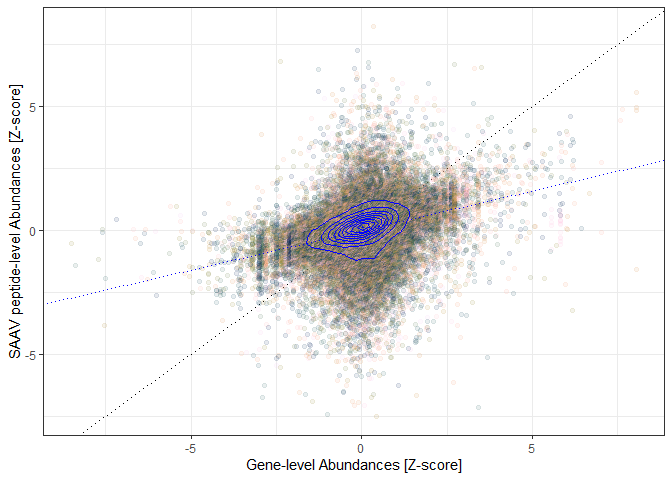

Variation Analysis
================
Marc Vaudel
2019-10-28

# 1\. Variation Analysis

In the [previous chapter](novel_peptides.md), novel peptides were
identified by Johansson *et al.* [(1)](#references) using a
proteogenomic search strategy. In addition, this search allowed
identifying peptides presenting single amino acid variants (SAAV).

## Libraries

We will need the following libraries, please make sure that they are
installed.

``` r
library(tidyr)
library(dplyr)
library(ggplot2)
library(scico)
library(gamlss)
library(conflicted)

theme_set(theme_bw(base_size = 11))

conflict_prefer("filter", "dplyr")
conflict_prefer("select", "dplyr")
```

## Genotype - peptide abundance relationship

Figure 7h displays the intensity of peptides produced by the reference
and alternative alleles of corresponding SNPs for each genotype.


> Figure 7h in Johansson *et al.*
[(1)](#references).

##### [:thought\_balloon:](answers.md#thought_balloon-if-we-assume-a-linear-relationship-between-number-of-alleles-and-peptide-abundance-what-should-be-the-peptide-distribution-for-each-genotype) *If we assume a linear relationship between number of alleles and peptide abundance, what should be the peptide distribution for each genotype?*

Note that the genotyping data corresponding to the peptide intensities
were not made available, but more examples can be found in
[Supplementary Figure
15](../resources/Johansson_et_al_breast_cancer_quantitative_proteome_and_proteogenomic_landscape/supplementary_information.pdf).

##### :speech\_balloon: Do the results presented follow a linear trend? What can affect the linearity of the relationship between number of alleles and intensity distribution?

## Abundance of variant peptides relative to the proteins

In [Supplementary Table
1](../resources/Johansson_et_al_breast_cancer_quantitative_proteome_and_proteogenomic_landscape)
and [Supplementary Table
6](../resources/Johansson_et_al_breast_cancer_quantitative_proteome_and_proteogenomic_landscape),
the authors provide the results of their proteogenomic analysis for
genes and for peptides carrying alternative alleles of SAAVs,
respectively. In addition, [Supplementary Table
1](../resources/Johansson_et_al_breast_cancer_quantitative_proteome_and_proteogenomic_landscape)
contains experimental design and sample characterization information.
The tables were extracted to an R-friendly text format for this
tutorial, and are available in
[resources/data/tumor.gz](resources/data/tumor.gz),
[resources/data/proteins.gz](resources/data/proteins.gz), and
[resources/data/saav.gz](resources/data/saav.gz).

##### :pencil2: Load the data in R as in the code below.

``` r
tumorDF <- read.table(
    file = "resources/data/tumor.gz",
    header = T,
    sep = "\t",
    comment.char = "",
    quote = "",
    stringsAsFactors = F
)

genesDF <- read.table(
    file = "resources/data/genes.gz",
    header = T,
    sep = "\t",
    comment.char = "",
    quote = "",
    stringsAsFactors = F
) %>%
    select(
        -contains("nspsm")
    )

saavDF <- read.table(
    file = "resources/data/saav.gz",
    header = T,
    sep = "\t",
    comment.char = "",
    quote = "",
    stringsAsFactors = F
)
```

Note that for the sake of speed, the last columns of the genes table
were
skipped.

##### [:thought\_balloon:](answers.md#thought_balloon-how-do-we-need-to-transform-the-tables-to-compare-saav-peptide-level-intensities-to-gene-level-intensities) *How do we need to transform the tables to compare SAAV peptide-level intensities to gene-level intensities?*

For the sake of time, this data transformation was run for you already.
The proposed solution is available in
[scripts/merge\_table\_1\_6.R](resources/data/saav.gz), and the
reformated SAAV peptides table is available in
[resources/data/table16.gz](resources/data/table16.gz). Note that in
this table one row represents a unique *{peptide sequence, gene
accession}*
pair.

##### [:thought\_balloon:](answers.md#thought_balloon-why-can-there-be-multiple-peptide-per-gene-and-gene-per-peptide-is-it-correct-to-represent-peptides-by-their-sequence) *Why can there be multiple peptide per gene, and gene per peptide? Is it correct to represent peptides by their sequence?*

In the following, we want to compare the abundances associated to SAAV
peptides to the abundances aggregated at the gene-level. For each tumor,
we will therefore only retain quantified *{peptide, gene}* pairs.

##### :pencil2: Load the reformated SAAV peptides table.

``` r
# Load the table

saavDF <- read.table(
    file = "resources/data/table16.gz",
    header = T,
    sep = "\t",
    comment.char = "",
    quote = "",
    stringsAsFactors = F
)


# Place holder for column names

tumorPeptideColumns <- paste0(tumorDF$tumor_id, "_saavPeptide")
tumorGeneColumns <- paste0(tumorDF$tumor_id, "_gene")
tumorColumns <- c(tumorPeptideColumns, tumorGeneColumns)


# For each tumor, keep only pairs of gene and peptide pairs

for (tumor in tumorDF$tumor_id) {
    
    peptideColumn <- paste0(tumor, "_saavPeptide")
    geneColumn <- paste0(tumor, "_gene")
    
    saavDF[[peptideColumn]][is.na(saavDF[[geneColumn]])] <- NA
    saavDF[[geneColumn]][is.na(saavDF[[peptideColumn]])] <- NA
    
}
```

##### :pencil2: Plot the intensity distributions as violin and box plots for the different tumors

``` r
# Transform the saav data frame from wide to long format using tidyr

intensitiesDF <- saavDF %>%
    gather(
        !!tumorColumns,
        key = "sample",
        value = "intensity"
    ) %>%
    filter(
        !is.na(intensity) & !is.infinite(intensity)
    ) %>%
    separate(
        col = sample,
        into = c("tumor", "species"),
        sep = "_"
    )


# Set levels for genes and peptides

intensitiesDF$species <- factor(
    intensitiesDF$species, 
    levels = c("gene", "saavPeptide")
)
levels(intensitiesDF$species) <- c("Gene", "SAAV Peptide")


# Build the plot

ggplot(
    data = intensitiesDF
) +
    geom_violin(
        mapping = aes(
            x = tumor,
            y = intensity,
            col = tumor
        ),
        fill = NA
    ) +
    geom_boxplot(
        mapping = aes(
            x = tumor,
            y = intensity,
            col = tumor
        ),
        fill = NA,
        outlier.shape = NA
    ) +
    facet_grid(
        species ~ .
    ) + 
    scale_fill_manual(
        values = scico(
            n = length(unique(intensitiesDF$tumor)),
            palette = "batlow",
            begin = 0.25,
            end = 0.75
        )
    ) +
    scale_color_manual(
        values = scico(
            n = length(unique(intensitiesDF$tumor)),
            palette = "batlow",
            begin = 0.25,
            end = 0.75
        )
    ) + 
    scale_y_continuous(
        name = "Intensity"
    ) + 
    theme(
        legend.position = "none",
        axis.title.x = element_blank(),
        axis.text.x = element_text(
            angle = 90,
            hjust = 0,
            vjust = 0.5
            
        ),
        panel.grid.major.x = element_blank(),
        panel.grid.minor.x = element_blank()
    )
```

<!-- -->

##### [:thought\_balloon:](answers.md#thought_balloon-why-are-all-intensities-at-the-bottom-how-can-we-better-visualize-these-distributions) *Why are all intensities at the bottom? How can we better visualize these distributions?*

As you can see, the gene-level intensities are centered around one, and
not for the peptide-level. You might have noticed in the paper that the
gene-level data as provided in the supplementary information are
centered, but this was not done for the
peptides.

##### :speech\_balloon: In your opinion why were the protein data centered? How would you recommend normalizing these data? Why?

Here, we hypothesize that SAAV peptides are sampled from these genes and
should therefore present the same abundance distribution. Data
acquisition and processing artefacts can influence the centering and
scaling. To correct for this, we will normalize the abundances from all
tumors using centile-based Z-scores.

``` r
# Iterate through the tumor columns

for (column in tumorColumns) {
    
    
    # Create a column name for the z-score transformed variables
    
    zColumn <- paste0("z_", column)
    
    
    # Create a data frame with only the columns of interest and filter out NA, zero, and infinite values
    
    trainingDF <- saavDF %>%
        select(
            gene, peptide_sequence, !!column
        ) %>%
        filter(
            !is.na(!!sym(column)) & !is.infinite(!!sym(column)) & !!sym(column) > 0
        )
    
    
    # Train the model
    
    trainingDF$x <- 0 # Note that it is possible to include covariates in the model instead of using a constant here
    
    model <- gamlss(
        formula = as.formula(paste0(column, " ~ x")),
        family = LOGNO,
        data = trainingDF,
        
    )
    
    
    # Compute the z-scores
    
    trainingDF[[zColumn]] <- centiles.pred(
        obj = model, 
        xname = "x", 
        xvalues = trainingDF$x, 
        yval = trainingDF[[column]], 
        type = "z-scores"
    )
    
    
    # Extract the transformed values
    
    trainingDF <- trainingDF %>%
        select(
            gene, peptide_sequence, !!zColumn
        )
    
    
    # Merge with the saav data frame
    
    saavDF <- saavDF %>%
        left_join(
            trainingDF,
            by = c("gene", "peptide_sequence")
        )
    
}
```

    ## GAMLSS-RS iteration 1: Global Deviance = 2027.455 
    ## GAMLSS-RS iteration 2: Global Deviance = 2027.455 
    ## GAMLSS-RS iteration 1: Global Deviance = 1300.237 
    ## GAMLSS-RS iteration 2: Global Deviance = 1300.237 
    ## GAMLSS-RS iteration 1: Global Deviance = 1880.204 
    ## GAMLSS-RS iteration 2: Global Deviance = 1880.204 
    ## GAMLSS-RS iteration 1: Global Deviance = 1857.933 
    ## GAMLSS-RS iteration 2: Global Deviance = 1857.933 
    ## GAMLSS-RS iteration 1: Global Deviance = 2045.205 
    ## GAMLSS-RS iteration 2: Global Deviance = 2045.205 
    ## GAMLSS-RS iteration 1: Global Deviance = 1966.413 
    ## GAMLSS-RS iteration 2: Global Deviance = 1966.413 
    ## GAMLSS-RS iteration 1: Global Deviance = 1566.112 
    ## GAMLSS-RS iteration 2: Global Deviance = 1566.112 
    ## GAMLSS-RS iteration 1: Global Deviance = 1491.397 
    ## GAMLSS-RS iteration 2: Global Deviance = 1491.397 
    ## GAMLSS-RS iteration 1: Global Deviance = 1600.611 
    ## GAMLSS-RS iteration 2: Global Deviance = 1600.611 
    ## GAMLSS-RS iteration 1: Global Deviance = 1454.124 
    ## GAMLSS-RS iteration 2: Global Deviance = 1454.124 
    ## GAMLSS-RS iteration 1: Global Deviance = 1391.497 
    ## GAMLSS-RS iteration 2: Global Deviance = 1391.497 
    ## GAMLSS-RS iteration 1: Global Deviance = 1499.707 
    ## GAMLSS-RS iteration 2: Global Deviance = 1499.707 
    ## GAMLSS-RS iteration 1: Global Deviance = 1727.284 
    ## GAMLSS-RS iteration 2: Global Deviance = 1727.284 
    ## GAMLSS-RS iteration 1: Global Deviance = 1354.763 
    ## GAMLSS-RS iteration 2: Global Deviance = 1354.763 
    ## GAMLSS-RS iteration 1: Global Deviance = 1381.672 
    ## GAMLSS-RS iteration 2: Global Deviance = 1381.672 
    ## GAMLSS-RS iteration 1: Global Deviance = 1513.597 
    ## GAMLSS-RS iteration 2: Global Deviance = 1513.597 
    ## GAMLSS-RS iteration 1: Global Deviance = 1508.408 
    ## GAMLSS-RS iteration 2: Global Deviance = 1508.408 
    ## GAMLSS-RS iteration 1: Global Deviance = 1501.329 
    ## GAMLSS-RS iteration 2: Global Deviance = 1501.329 
    ## GAMLSS-RS iteration 1: Global Deviance = 3247.767 
    ## GAMLSS-RS iteration 2: Global Deviance = 3247.767 
    ## GAMLSS-RS iteration 1: Global Deviance = 3154.528 
    ## GAMLSS-RS iteration 2: Global Deviance = 3154.528 
    ## GAMLSS-RS iteration 1: Global Deviance = 2788.806 
    ## GAMLSS-RS iteration 2: Global Deviance = 2788.806 
    ## GAMLSS-RS iteration 1: Global Deviance = 3722.134 
    ## GAMLSS-RS iteration 2: Global Deviance = 3722.134 
    ## GAMLSS-RS iteration 1: Global Deviance = 3065.699 
    ## GAMLSS-RS iteration 2: Global Deviance = 3065.699 
    ## GAMLSS-RS iteration 1: Global Deviance = 3226.883 
    ## GAMLSS-RS iteration 2: Global Deviance = 3226.883 
    ## GAMLSS-RS iteration 1: Global Deviance = 2334.491 
    ## GAMLSS-RS iteration 2: Global Deviance = 2334.491 
    ## GAMLSS-RS iteration 1: Global Deviance = 2561.947 
    ## GAMLSS-RS iteration 2: Global Deviance = 2561.947 
    ## GAMLSS-RS iteration 1: Global Deviance = 3247.387 
    ## GAMLSS-RS iteration 2: Global Deviance = 3247.387 
    ## GAMLSS-RS iteration 1: Global Deviance = 3081.291 
    ## GAMLSS-RS iteration 2: Global Deviance = 3081.291 
    ## GAMLSS-RS iteration 1: Global Deviance = 2890.455 
    ## GAMLSS-RS iteration 2: Global Deviance = 2890.455 
    ## GAMLSS-RS iteration 1: Global Deviance = 3500.093 
    ## GAMLSS-RS iteration 2: Global Deviance = 3500.093 
    ## GAMLSS-RS iteration 1: Global Deviance = 3576.319 
    ## GAMLSS-RS iteration 2: Global Deviance = 3576.319 
    ## GAMLSS-RS iteration 1: Global Deviance = 3403.956 
    ## GAMLSS-RS iteration 2: Global Deviance = 3403.956 
    ## GAMLSS-RS iteration 1: Global Deviance = 4171.327 
    ## GAMLSS-RS iteration 2: Global Deviance = 4171.327 
    ## GAMLSS-RS iteration 1: Global Deviance = 3033.924 
    ## GAMLSS-RS iteration 2: Global Deviance = 3033.924 
    ## GAMLSS-RS iteration 1: Global Deviance = 2499.132 
    ## GAMLSS-RS iteration 2: Global Deviance = 2499.132 
    ## GAMLSS-RS iteration 1: Global Deviance = 3417.91 
    ## GAMLSS-RS iteration 2: Global Deviance = 3417.91 
    ## GAMLSS-RS iteration 1: Global Deviance = 3859.863 
    ## GAMLSS-RS iteration 2: Global Deviance = 3859.863 
    ## GAMLSS-RS iteration 1: Global Deviance = 2884.593 
    ## GAMLSS-RS iteration 2: Global Deviance = 2884.593 
    ## GAMLSS-RS iteration 1: Global Deviance = 3195.717 
    ## GAMLSS-RS iteration 2: Global Deviance = 3195.717 
    ## GAMLSS-RS iteration 1: Global Deviance = 3481.365 
    ## GAMLSS-RS iteration 2: Global Deviance = 3481.365 
    ## GAMLSS-RS iteration 1: Global Deviance = 3416.908 
    ## GAMLSS-RS iteration 2: Global Deviance = 3416.908 
    ## GAMLSS-RS iteration 1: Global Deviance = 4189.568 
    ## GAMLSS-RS iteration 2: Global Deviance = 4189.568 
    ## GAMLSS-RS iteration 1: Global Deviance = 2650.29 
    ## GAMLSS-RS iteration 2: Global Deviance = 2650.29 
    ## GAMLSS-RS iteration 1: Global Deviance = 2568.541 
    ## GAMLSS-RS iteration 2: Global Deviance = 2568.541 
    ## GAMLSS-RS iteration 1: Global Deviance = 2926.19 
    ## GAMLSS-RS iteration 2: Global Deviance = 2926.19 
    ## GAMLSS-RS iteration 1: Global Deviance = 693.3155 
    ## GAMLSS-RS iteration 2: Global Deviance = 693.3155 
    ## GAMLSS-RS iteration 1: Global Deviance = 1076.556 
    ## GAMLSS-RS iteration 2: Global Deviance = 1076.556 
    ## GAMLSS-RS iteration 1: Global Deviance = 195.5654 
    ## GAMLSS-RS iteration 2: Global Deviance = 195.5654 
    ## GAMLSS-RS iteration 1: Global Deviance = 865.6185 
    ## GAMLSS-RS iteration 2: Global Deviance = 865.6185 
    ## GAMLSS-RS iteration 1: Global Deviance = 1095.07 
    ## GAMLSS-RS iteration 2: Global Deviance = 1095.07 
    ## GAMLSS-RS iteration 1: Global Deviance = 126.089 
    ## GAMLSS-RS iteration 2: Global Deviance = 126.089 
    ## GAMLSS-RS iteration 1: Global Deviance = 611.7388 
    ## GAMLSS-RS iteration 2: Global Deviance = 611.7388 
    ## GAMLSS-RS iteration 1: Global Deviance = 466.5559 
    ## GAMLSS-RS iteration 2: Global Deviance = 466.5559 
    ## GAMLSS-RS iteration 1: Global Deviance = 921.7777 
    ## GAMLSS-RS iteration 2: Global Deviance = 921.7777 
    ## GAMLSS-RS iteration 1: Global Deviance = 711.1848 
    ## GAMLSS-RS iteration 2: Global Deviance = 711.1848 
    ## GAMLSS-RS iteration 1: Global Deviance = 489.9322 
    ## GAMLSS-RS iteration 2: Global Deviance = 489.9322 
    ## GAMLSS-RS iteration 1: Global Deviance = 525.162 
    ## GAMLSS-RS iteration 2: Global Deviance = 525.162 
    ## GAMLSS-RS iteration 1: Global Deviance = 637.9658 
    ## GAMLSS-RS iteration 2: Global Deviance = 637.9658 
    ## GAMLSS-RS iteration 1: Global Deviance = 574.2767 
    ## GAMLSS-RS iteration 2: Global Deviance = 574.2767 
    ## GAMLSS-RS iteration 1: Global Deviance = 521.4437 
    ## GAMLSS-RS iteration 2: Global Deviance = 521.4437 
    ## GAMLSS-RS iteration 1: Global Deviance = 759.0655 
    ## GAMLSS-RS iteration 2: Global Deviance = 759.0655 
    ## GAMLSS-RS iteration 1: Global Deviance = 826.0473 
    ## GAMLSS-RS iteration 2: Global Deviance = 826.0473 
    ## GAMLSS-RS iteration 1: Global Deviance = 650.8084 
    ## GAMLSS-RS iteration 2: Global Deviance = 650.8084 
    ## GAMLSS-RS iteration 1: Global Deviance = 1076.141 
    ## GAMLSS-RS iteration 2: Global Deviance = 1076.141 
    ## GAMLSS-RS iteration 1: Global Deviance = 346.3175 
    ## GAMLSS-RS iteration 2: Global Deviance = 346.3175 
    ## GAMLSS-RS iteration 1: Global Deviance = 2112.151 
    ## GAMLSS-RS iteration 2: Global Deviance = 2112.151 
    ## GAMLSS-RS iteration 1: Global Deviance = 1758.988 
    ## GAMLSS-RS iteration 2: Global Deviance = 1758.988 
    ## GAMLSS-RS iteration 1: Global Deviance = 1404.673 
    ## GAMLSS-RS iteration 2: Global Deviance = 1404.673 
    ## GAMLSS-RS iteration 1: Global Deviance = 827.4501 
    ## GAMLSS-RS iteration 2: Global Deviance = 827.4501 
    ## GAMLSS-RS iteration 1: Global Deviance = 746.5591 
    ## GAMLSS-RS iteration 2: Global Deviance = 746.5591 
    ## GAMLSS-RS iteration 1: Global Deviance = 1074.38 
    ## GAMLSS-RS iteration 2: Global Deviance = 1074.38 
    ## GAMLSS-RS iteration 1: Global Deviance = 1323.115 
    ## GAMLSS-RS iteration 2: Global Deviance = 1323.115 
    ## GAMLSS-RS iteration 1: Global Deviance = 1436.366 
    ## GAMLSS-RS iteration 2: Global Deviance = 1436.366 
    ## GAMLSS-RS iteration 1: Global Deviance = 1461.965 
    ## GAMLSS-RS iteration 2: Global Deviance = 1461.965 
    ## GAMLSS-RS iteration 1: Global Deviance = 924.9015 
    ## GAMLSS-RS iteration 2: Global Deviance = 924.9015 
    ## GAMLSS-RS iteration 1: Global Deviance = 1244.586 
    ## GAMLSS-RS iteration 2: Global Deviance = 1244.586 
    ## GAMLSS-RS iteration 1: Global Deviance = 899.9695 
    ## GAMLSS-RS iteration 2: Global Deviance = 899.9695 
    ## GAMLSS-RS iteration 1: Global Deviance = 1504.276 
    ## GAMLSS-RS iteration 2: Global Deviance = 1504.276 
    ## GAMLSS-RS iteration 1: Global Deviance = 1397.485 
    ## GAMLSS-RS iteration 2: Global Deviance = 1397.485 
    ## GAMLSS-RS iteration 1: Global Deviance = -116.1728 
    ## GAMLSS-RS iteration 2: Global Deviance = -116.1728 
    ## GAMLSS-RS iteration 1: Global Deviance = 861.8912 
    ## GAMLSS-RS iteration 2: Global Deviance = 861.8912 
    ## GAMLSS-RS iteration 1: Global Deviance = 1455.807 
    ## GAMLSS-RS iteration 2: Global Deviance = 1455.807 
    ## GAMLSS-RS iteration 1: Global Deviance = 973.2334 
    ## GAMLSS-RS iteration 2: Global Deviance = 973.2334 
    ## GAMLSS-RS iteration 1: Global Deviance = 618.1967 
    ## GAMLSS-RS iteration 2: Global Deviance = 618.1967 
    ## GAMLSS-RS iteration 1: Global Deviance = 416.7871 
    ## GAMLSS-RS iteration 2: Global Deviance = 416.7871 
    ## GAMLSS-RS iteration 1: Global Deviance = 565.1233 
    ## GAMLSS-RS iteration 2: Global Deviance = 565.1233 
    ## GAMLSS-RS iteration 1: Global Deviance = 1401.728 
    ## GAMLSS-RS iteration 2: Global Deviance = 1401.728 
    ## GAMLSS-RS iteration 1: Global Deviance = 982.3325 
    ## GAMLSS-RS iteration 2: Global Deviance = 982.3325 
    ## GAMLSS-RS iteration 1: Global Deviance = 516.3645 
    ## GAMLSS-RS iteration 2: Global Deviance = 516.3645 
    ## GAMLSS-RS iteration 1: Global Deviance = 997.388 
    ## GAMLSS-RS iteration 2: Global Deviance = 997.388

##### :pencil2: For a tumor and plot the normalized values against the original ones.

``` r
# Select a column randomly

column <- sample(
    x = tumorColumns,
    size = 1
)
zColumn <- paste0("z_", column)


# Build the plot

ggplot(
    data = saavDF
) +
    geom_point(
        mapping = aes(
            x = !!sym(column),
            y = !!sym(zColumn)
        ),
        alpha = 0.05
    )
```

    ## Warning: Removed 2971 rows containing missing values (geom_point).

<!-- -->

##### [:thought\_balloon:](answers.md#thought_balloon-why-does-the-curve-have-this-shape) *Why does the curve have this shape?*

##### :pencil2: Plot the distributions like before after normalization.

``` r
# Placeholder for the z-transformed columns

zTumorColumns <- paste0("z_", tumorColumns)


# Transform the saav data frame from wide to long format using tidyr

intensitiesDF <- saavDF %>%
    select(
        -!!tumorColumns
    ) %>%
    gather(
        !!zTumorColumns,
        key = "sample",
        value = "intensity"
    ) %>%
    filter(
        !is.na(intensity) & !is.infinite(intensity)
    ) %>%
    separate(
        col = sample,
        into = c(NA, "tumor", "species"),
        sep = "_"
    )


# Set levels for the genes and peptides

intensitiesDF$species <- factor(
    intensitiesDF$species, 
    levels = c("gene", "saavPeptide")
)
levels(intensitiesDF$species) <- c("Gene", "SAAV Peptide")


# Build the plot

ggplot(
    data = intensitiesDF
) +
    geom_violin(
        mapping = aes(
            x = tumor,
            y = intensity,
            col = tumor
        ),
        fill = NA
    ) +
    geom_boxplot(
        mapping = aes(
            x = tumor,
            y = intensity,
            col = tumor
        ),
        fill = NA,
        outlier.shape = NA
    ) +
    facet_grid(
        species ~ .
    ) + 
    scale_fill_manual(
        values = scico(
            n = length(unique(intensitiesDF$tumor)),
            palette = "batlow",
            begin = 0.25,
            end = 0.75
        )
    ) +
    scale_color_manual(
        values = scico(
            n = length(unique(intensitiesDF$tumor)),
            palette = "batlow",
            begin = 0.25,
            end = 0.75
        )
    ) + 
    scale_y_continuous(
        name = "Intensity"
    ) + 
    theme(
        legend.position = "none",
        axis.title.x = element_blank(),
        axis.text.x = element_text(
            angle = 90,
            hjust = 0,
            vjust = 0.5
            
        ),
        panel.grid.major.x = element_blank(),
        panel.grid.minor.x = element_blank()
    )
```

<!-- -->

##### :pencil2: Plot the gene- and peptide- level abundances.

``` r
# Transform the saav data frame from wide to long format, and separate genes and proteins using tidyr

intensitiesDF <- saavDF %>%
    select(
        -!!tumorColumns
    ) %>%
    gather(
        !!zTumorColumns,
        key = "sample",
        value = "intensity"
    ) %>%
    filter(
        !is.na(intensity) & !is.infinite(intensity)
    ) %>%
    separate(
        col = sample,
        into = c(NA, "tumor", "species"),
        sep = "_"
    ) %>%
    mutate (
        species = ifelse(species == "gene", "gene_abundance", "saav_peptide_abundance")
    ) %>%
    spread(
        key = species,
        value = intensity
    ) %>%
    filter(
        !is.na(saav_peptide_abundance) & !is.na(gene_abundance)
    ) %>%
    arrange(
        abs(saav_peptide_abundance - gene_abundance)
    )


# Run a linear model, for each tumor separately then for all values

model <- lm(
    data = intensitiesDF,
    formula = saav_peptide_abundance ~ gene_abundance
)

summary(model)
```

    ## 
    ## Call:
    ## lm(formula = saav_peptide_abundance ~ gene_abundance, data = intensitiesDF)
    ## 
    ## Residuals:
    ##     Min      1Q  Median      3Q     Max 
    ## -7.9059 -0.3102  0.0856  0.4188  7.9737 
    ## 
    ## Coefficients:
    ##                  Estimate Std. Error t value Pr(>|t|)    
    ## (Intercept)    -0.0002376  0.0038858  -0.061    0.951    
    ## gene_abundance  0.3064531  0.0038919  78.741   <2e-16 ***
    ## ---
    ## Signif. codes:  0 '***' 0.001 '**' 0.01 '*' 0.05 '.' 0.1 ' ' 1
    ## 
    ## Residual standard error: 0.9514 on 59945 degrees of freedom
    ## Multiple R-squared:  0.09373,    Adjusted R-squared:  0.09372 
    ## F-statistic:  6200 on 1 and 59945 DF,  p-value: < 2.2e-16

``` r
# Build the plot

axisLimit <- max(abs(c(intensitiesDF$gene_abundance, intensitiesDF$saav_peptide_abundance)))

ggplot(
    data = intensitiesDF
) +
    geom_point(
        mapping = aes(
            x = gene_abundance,
            y = saav_peptide_abundance,
            col = tumor
        ),
        alpha = 0.2
    ) +
    geom_density2d(
        mapping = aes(
            x = gene_abundance,
            y = saav_peptide_abundance,
        ),
        col = "blue"
    ) + 
    geom_smooth(
        mapping = aes(
            x = gene_abundance,
            y = saav_peptide_abundance,
        ),
        method = 'lm',
        formula = y ~ x,
        col = "blue",
        linetype = "dotted"
    ) +
    scale_x_continuous(
        name = "Gene-level Abundances [Z-score]",
        limits = c(-axisLimit, axisLimit)
    ) +
    scale_y_continuous(
        name = "SAAV peptide-level Abundances [Z-score]",
        limits = c(-axisLimit, axisLimit)
    ) +
    scale_color_manual(
        name = "Tumor Subtype",
        values = scico(
            n = length(unique(intensitiesDF$tumor)),
            palette = "batlow"
        )
    ) +
    theme(
        legend.position = "none"
    )
```

<!-- -->

##### :speech\_balloon: What do you think about the SAAV peptide to gene agreement?

## References

1)  [Breast cancer quantitative proteome and proteogenomic
    landscape](https://www.ncbi.nlm.nih.gov/pubmed/30962452)
